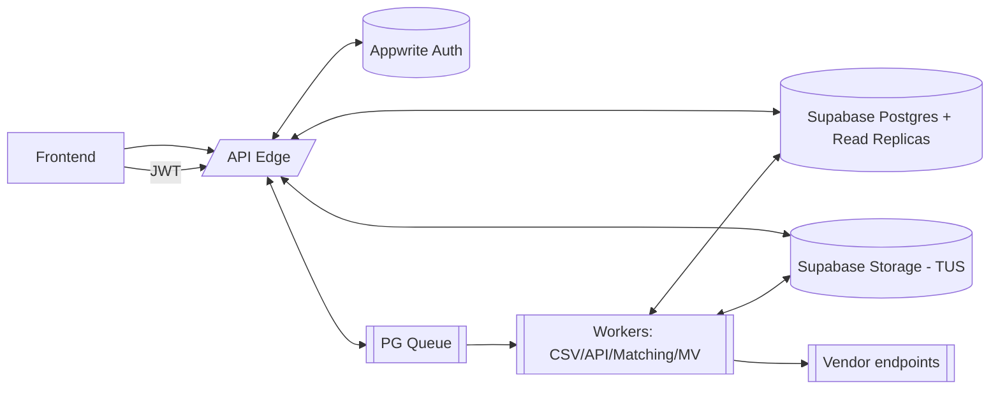
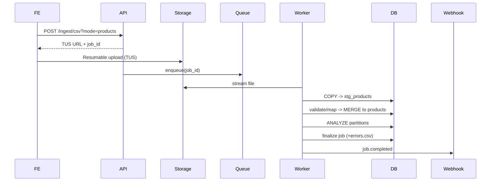

# PRD v1 — Odyssey B2B (Backend)

## 0) Product frame
- **Region:** USA
- **Regulatory:** HIPAA (Security & Privacy Rules; documentation retention 6 years)
- **Goal:** Multi-tenant B2B nutrition platform: vendor catalogs, customer+health profiles, ingestion (CSV/API), search, health-aware matching, admin/RBAC.
- **Scale targets:** 50 vendors; per vendor up to **500k products**, **1M customers**; CSV ingest **5–10 GB / ≤ 2M rows/job** (resumable).
- **SLOs:** `/matches` P95 ≤ 500 ms; list/search P95 ≤ 300 ms; ingest 2M rows ≤ 45 min (COPY pipeline).
- **Environments:** dev, stage, prod (separate projects, DBs, storage buckets).

---

## 1) Architecture

### 1.1 High-level
- **API Edge:** Next.js Route Handlers (App Router).
- **AuthN/Z:** Appwrite JWT on every call; RBAC (roles below). Appwrite Teams/Users for tenancy identity.
- **Data:** Supabase Postgres (+ read replicas for heavy reads/search) and Supabase Storage (TUS resumable uploads).
- **Queue/Workers:** Postgres-backed queue with `SELECT … FOR UPDATE SKIP LOCKED` for multi-consumer dispatch.
- **Errors:** Problem Details for HTTP APIs (RFC 9457).
- **Idempotency:** `Idempotency-Key` on POST/PUT/PATCH + server-side store.
- **Webhooks:** HMAC-SHA256 signature + timestamp; at-least-once delivery + retries + DLQ.

---

## 2) Tenancy, roles, security

### 2.1 Tenancy
- Single DB; strict tenant isolation: every row has `vendor_id`; all queries scoped by `vendor_id`.
- Partitioning prunes by vendor (see §4).

### 2.2 Roles
- `superadmin` (platform, break-glass only), `vendor_admin`, `vendor_operator`, `vendor_viewer`.
- Minimum necessary: health data requires elevated scope; all health reads/writes audited.

### 2.3 HIPAA controls (MVP)
- Safeguards: administrative/physical/technical per Security Rule.
- Retention: documentation/audit artifacts **6 years**.
- Encryption: in-transit (TLS) and at-rest (platform-provided).

---

## 3) Secrets & keys (platform-specific)
- **Runtime secrets:**
  - Appwrite Functions → Appwrite env vars.
  - Supabase Edge Functions → `supabase secrets`.
- **Database-held secrets/PII:** Supabase Vault (encrypted; SQL access; audited).
- **Storage:** Supabase Storage TUS resumable uploads for large CSVs.
- **Master keys:** managed cloud KMS; envelope encryption; rotation policy.
- **Guardrails:** no secrets in code/logs/images; least-privilege IAM; audit secret reads; CI secret scanning; rotation runbooks.

---

## 4) Data model & physical design

### 4.1 Partitioning & indexes (scale-ready)
- **Partitioning:** parent tables are LIST partitioned by `vendor_id`; each vendor partition has HASH sub-partitions (Products ×16; Customers ×32). Enables vendor pruning; keeps indexes small; avoids thousands of partitions.
- **FTS:** trigger-maintained `tsvector` (name, brand, short description) with GIN index.
- **Arrays:** GIN on `tags[]`, `allergens[]` only if filter paths use them.
- **Analyze:** run `ANALYZE` after heavy loads to refresh stats.
- **Read replicas:** serve `/search` + analytics; replication lag acknowledged in UX.

### 4.2 Tables (required fields first; optional afterward)

**vendors**
- `id (pk)`, `name`, `status`, `created_at`, `updated_at`, `settings_json`, `catalog_version`

**users** *(identity in Appwrite; shadow link only)*
- `id (pk)`, `email`, `display_name`, timestamps

**user_links** *(tenant membership + RBAC)*
- `id (pk)`, `user_id fk`, `vendor_id fk`, `role enum(superadmin|vendor_admin|vendor_operator|vendor_viewer)`, `status`, timestamps, **UQ(user_id,vendor_id)**

**platform_admins** *(superadmin registry)*
- `user_id (pk)`, audit fields

**products** *(LIST by vendor → HASH×16)*
- Required: `id (pk uuid)`, `vendor_id`, `external_id`, `name`, `brand`, `description`, `category_id`, `price`, `currency ('USD')`, `status enum(active|inactive)`, `search_tsv tsvector`, `created_at`, `updated_at`
- Optional: `barcode`, `gtin_type`, `ingredients (text)`, `sub_category_id`, `cuisine_id`, `market_id`, `nutrition jsonb` (per-serving), `serving_size`, `package_weight`, `dietary_tags text[]`, `allergens text[]`, `certifications text[]`, `regulatory_codes text[]`, `source_url`, `soft_deleted_at`
- Indexes: `PK(id)`, `UQ(vendor_id,external_id)`, `UQ(vendor_id,barcode)`, `GIN(search_tsv)`, optional `GIN(dietary_tags)`, `GIN(allergens)`

**product_images**
- `id (pk)`, `product_id fk`, `url`, `alt`, `order`, timestamps

**product_sources** *(lineage)*
- `id (pk)`, `product_id fk`, `source enum(csv|api)`, `source_ref`, `ingestion_job_id fk`, timestamps

**customers** *(LIST by vendor → HASH×32)*
- Required: `id (pk)`, `vendor_id`, `external_id`, `full_name`, `email`, `dob` or `age`, `gender`, `location`, timestamps
- Optional: `phone`, `custom_tags text[]`, `search_tsv`, `created_by`, `updated_by`
- Indexes: `UQ(vendor_id,external_id)`, optional `GIN(search_tsv)`

**customer_health_profiles** *(1-to-1)*
- Required: `customer_id (pk,fk)`, `height_cm`, `weight_kg`, `age`, `gender`, `activity_level enum(sedentary|light|moderate|very|extra)`, `conditions text[]`, `diet_goals text[]`, `macro_targets jsonb`, `avoid_allergens text[]`
- Derived: `bmi`, `bmr`, `tdee_cached`, `derived_limits jsonb` (soft budgets by condition)
- Audit: `created_at`, `updated_at`, `updated_by`

**customer_consents**
- `id (pk)`, `customer_id fk`, `consent_type`, `granted boolean`, `version`, `timestamp`

**customer_whitelists / customer_blacklists**
- `id (pk)`, `customer_id fk`, `product_id fk`, `note`, timestamps

**tax_categories / tax_tags / tax_allergens / tax_cuisines / tax_certifications**
- `id (pk)`, `code`, `label`, `parent_id?`, `active`, timestamps

**synonyms_header** *(ingestion header auto-map)*
- `id (pk)`, `canonical`, `synonyms text[]`, `transform_ops jsonb`, `confidence default 1.0`

**synonyms_value** *(value normalization: allergens/conditions/units)*
- `id (pk)`, `domain enum(allergen|condition|unit|diet|gender|activity)`, `canonical`, `synonyms text[]`

**vendor_mappings** *(per-vendor override of header→field)*
- `id (pk)`, `vendor_id`, `mode enum(products|customers)`, `map jsonb`, `version`, timestamps

**ingestion_jobs**
- `id (pk)`, `vendor_id`, `mode enum(products|customers|api_sync)`, `status enum(queued|running|failed|completed|canceled)`, `progress_pct`, `totals jsonb`, `error_url`, `started_at`, `finished_at`, `attempt`, `params jsonb`

**ingestion_job_errors**
- `id (pk)`, `job_id fk`, `row_no`, `field`, `code`, `message`, `raw jsonb`

**stg_products / stg_customers** *(staging; thin indexes)*
- Columns mirroring canonical superset; `job_id`, `vendor_id`, raw columns; purge after merge.

**stg_vendor_raw** *(API pages)*
- `id (pk)`, `vendor_id`, `source`, `page_id`, `payload jsonb`, `fetched_at`; TTL 30 days.

**connectors** *(per-vendor API config)*
- `id (pk)`, `vendor_id`, `source`, `base_url`, `auth_type`, `rate_limit_rpm`, `secrets_ref (vault)`, `enabled`, timestamps

**connector_cursors**
- `id (pk)`, `vendor_id`, `source`, `cursor`, `synced_at`, `status`

**matches_cache**
- `vendor_id`, `customer_id`, `catalog_version`, `results jsonb`, `ttl_at` → **PK(vendor_id, customer_id, catalog_version)**

**diet_rules** *(JSON policies per condition; vendor-tunable)*
- `id (pk)`, `vendor_id`, `condition_code`, `policy jsonb`, `active`, `version`, timestamps

**scoring_policies**
- `id (pk)`, `vendor_id`, `weights jsonb` (preference fit, budget fit, recency), `active`, timestamps

**webhook_endpoints**
- `id (pk)`, `vendor_id`, `url`, `secret_ref (vault)`, `enabled`, `description`, `retries_max`, `tolerance_sec`, timestamps

**webhook_deliveries**
- `id (pk)`, `endpoint_id fk`, `event_type`, `payload jsonb`, `status`, `attempt`, `last_error`, `signature`, `timestamp`

**idempotency_keys**
- `key (pk)`, `vendor_id`, `method`, `path`, `request_hash`, `response_hash`, `status`, `created_at`, `expires_at` (24h typical)

**audit_log**
- `id (pk)`, `actor_user_id`, `actor_role`, `vendor_id?`, `action`, `entity`, `entity_id`, `before jsonb`, `after jsonb`, `ip`, `ua`, `justification?`, `timestamp`

---

## 5) APIs (v1). Paths, auth, RBAC, contracts

### 5.1 Conventions
- Auth: Appwrite JWT (bearer).
- Tenancy: `vendor_id` resolved from JWT/team membership; no vendor in URL.
- Idempotency: `Idempotency-Key` header on POST/PUT/PATCH (store/replay).
- Errors: `application/problem+json` (RFC 9457).
- Pagination: cursor (`next_cursor`), `limit ≤ 200`.
- Rate limits: 60 rpm/user; 600 rpm/vendor; ingest endpoints 6 rpm/vendor.

### 5.2 Products
- `GET /api/v1/products` — filters: `q`, `brand`, `category_id`, `tags.any`, `allergens.none`, `updated_after`, `sort (-updated_at|relevance)`, `cursor`, `limit`
- `POST /api/v1/products` — batch upsert (≤10k per call); idempotent
- `GET /api/v1/products/:id`
- `PATCH /api/v1/products/:id`
- `DELETE /api/v1/products/:id` (soft)

### 5.3 Customers & Health
- `GET /api/v1/customers` (search/filter)
- `POST /api/v1/customers` — batch upsert
- `GET|PUT|PATCH|DELETE /api/v1/customers/:id`
- `GET /api/v1/customers/:id/health` *(admin/operator)*
- `PUT /api/v1/customers/:id/health` — validate units, compute BMI, BMR (Mifflin-St Jeor), TDEE, update `derived_limits`

### 5.4 Ingestion (CSV)
- `POST /api/v1/ingest/csv?mode=products|customers` — returns signed TUS upload URL + `job_id`
- `GET /api/v1/jobs/:id` — job status/progress/error_url

**Worker flow:** Storage (TUS) → `COPY` to staging → validate/auto-map (synonyms) → `MERGE/ON CONFLICT` to live partitions in 100k–250k batches → `ANALYZE` → finalize job; emit webhook.

### 5.5 Connectors (External APIs)
- `PUT /api/v1/connectors/:source` — set `base_url`, auth, rate, secrets_ref
- `POST /api/v1/connectors/:source/test`
- `POST /api/v1/connectors/:source/sync` — enqueue sync job
- `GET /api/v1/jobs/:id`

### 5.6 Search
- `GET /api/v1/search/products?q=...&filters...` — FTS (tsvector + GIN), filters, sort by relevance/updated_at.

### 5.7 Matching
- `GET /api/v1/matches/:customerId?k=20` — hard filters (allergens, explicit limits); soft budgets from `derived_limits`; deterministic scoring; cache on `(vendor_id, customer_id, catalog_version)`.

### 5.8 Taxonomy
- CRUD: categories, tags, allergens, cuisines, certifications; synonym management.

### 5.9 Webhooks
- Events: `job.completed`, `job.failed`, `product.updated`, `customer.updated`.
- Headers: `X-Idempotency-Key`, signature headers (`timestamp`, `v1=<hmac>`). Verify HMAC-SHA256 over `timestamp + "\n" + raw_body`; reject stale timestamps.

---

## 6) Workflows

### 6.1 Login & RBAC resolve
1. FE obtains Appwrite session → JWT.
2. API verifies JWT; loads `user_links` → `{vendor_id, role}`; scopes request.

### 6.2 CSV ingest (products/customers)

### 6.3 API connector sync
- Rate-limited paged fetch → `stg_vendor_raw` → normalize/map → merge → checkpoint cursors; retries + backoff.

### 6.4 Matching request (cache miss)
- Load customer+health → prefilter (FTS/arrays) ≤200 → score with soft budgets → store `matches_cache` (15 min TTL) → respond.

### 6.5 Webhook delivery & retry
- Sign payload (HMAC-SHA256 + timestamp) → POST → on 2xx mark delivered; else exponential retries → DLQ.

---

## 7) Business logic (deterministic)

### 7.1 Customer health derivations
- **BMR:** Mifflin-St Jeor; **TDEE = BMR × activity_factor** (sedentary≈1.2, light≈1.375, moderate≈1.55, very≈1.725, extra≈1.9). Store `tdee_cached`.
- **Derived limits:** compute daily ceilings from condition templates (defaults seeded; vendor-tunable).

### 7.2 Matching & scoring
- **Hard filters:** avoid allergens; respect explicit customer nutrient limits; vendor diet hard rules.
- **Soft budgets:** from `derived_limits`; penalize servings that consume large fractions of daily budgets; bonus fiber for diabetes template.
- **Tie-breakers:** recency, deterministic ID order. Stable outputs for same inputs.

---

## 8) Non-functional & ops

### 8.1 Scaling posture
- Postgres partitioning: LIST by vendor; HASH sub-partitions (Products ×16; Customers ×32). Use partition pruning and local indexes.
- COPY bulk load; minimal indexes on staging; ANALYZE after merges.
- Queue: multi-consumer with SKIP LOCKED; per-vendor concurrency caps.
- Read replicas: route `/search` + analytics; handle lag in UX.

### 8.2 Observability
- **Logs:** `req_id, user_id, vendor_id, role, route, status, latency_ms, rows_read, rows_written`.
- **Metrics:** RPS, p50/p95, error rates, queue depth/lag, job throughput, replica lag.
- **Audit:** RBAC changes; health reads/writes; data deletes; break-glass sessions.

### 8.3 Availability, DR, retention
- **Uptime:** 99.9%/mo API.
- **Backups:** daily full + PITR 7–30 days.
- **Retention:** audit/required documentation 6 y; raw API pages 30 d; ingest error files 90 d.

---

## 9) Validation & error model
- **Problem+JSON** (RFC 9457): `type`, `title`, `status`, `detail`, `instance`, optional `errors[]` for field issues.
- **Per-row ingest errors** in `ingestion_job_errors` and downloadable `errors.csv`.

---

## 10) Acceptance criteria

**Functionality**
- Products/Customers CRUD and idempotent batch upserts; uniqueness enforced.
- CSV ingest supports 5–10 GB / ≤2M rows; resumable uploads; job progress + errors.
- Connectors sync with paging/rate-limits; checkpoints; retries; raw storage 30 d.
- Matching returns K results with deterministic scoring; respects hard/soft rules; caches with `catalog_version`.
- Search uses FTS (GIN) + filters + cursor pagination.

**Performance**
- Meets SLOs; COPY-based ingest finishes within target; ANALYZE run after merges.

**Security**
- JWT validated each call; role enforcement; minimum-necessary health access; full audit.
- Webhooks signed and verified; secrets managed per §3.

---

## 11) Appendix A — Field catalogs (full)

### 11.1 Products (all attributes)
- **Identity:** `id uuid`, `vendor_id uuid`, `external_id text`, `barcode text?`, `gtin_type enum?`
- **Core:** `name text`, `brand text`, `description text`, `category_id fk`, `sub_category_id fk?`, `cuisine_id fk?`, `market_id fk?`
- **Nutrition:** `nutrition jsonb` (per-serving nutrients); `serving_size text?`, `package_weight text?`
- **Commerce:** `price numeric(12,2)`, `currency char(3) default 'USD'`, `status enum`
- **Tags & compliance:** `dietary_tags text[]?`, `allergens text[]?`, `certifications text[]?`, `regulatory_codes text[]?`
- **Search:** `search_tsv tsvector`
- **Lineage:** `source_url?`, `soft_deleted_at?`, timestamps

### 11.2 Customers
- **Identity:** `id uuid`, `vendor_id uuid`, `external_id text` (UQ per vendor)
- **Profile:** `full_name`, `email`, `dob date?`, `age int?`, `gender enum(male|female|other|unspecified)`, `location jsonb`
- **Misc:** `phone?`, `custom_tags text[]?`, `search_tsv?`, timestamps

### 11.3 Health profile
- **Inputs:** `height_cm numeric(5,2)`, `weight_kg numeric(6,2)`, `age int`, `gender`, `activity_level enum(sedentary|light|moderate|very|extra)`, `conditions text[]`, `diet_goals text[]`, `macro_targets jsonb`, `avoid_allergens text[]`
- **Derived:** `bmi numeric(5,2)`, `bmr numeric(8,2)`, `tdee_cached numeric(8,2)`, `derived_limits jsonb`
- **Audit:** `updated_by`, timestamps

### 11.4 Ingestion & mapping
- `vendor_mappings.map` sample: `{"height": {"field":"height_cm","ops":["ftin_to_cm"]}}`
- `synonyms_header` and `synonyms_value` seed canonicalization dictionaries.

### 11.5 Webhooks
- **Events:** payload includes `vendor_id`, `event_id`, `occurred_at`, `data`.
- **Signature:** compute `HMAC_SHA256(secret, timestamp + "\n" + raw_body)`; headers `X-Timestamp`, `X-Signature`.

---

## 12) Appendix B — Operational runbooks

**Bulk ingest (CSV)**
1) Upload via TUS.
2) Worker `COPY` → staging (fastest bulk path).
3) Validate+map; `MERGE` or `INSERT … ON CONFLICT` in 100k–250k batches; `ANALYZE` partitions.
4) Emit `errors.csv`; finalize job.

**Queue**
- Consumer loop: `SELECT … FOR UPDATE SKIP LOCKED` → process → finalize; retries with exponential backoff → DLQ.

**Indexes**
- Local per sub-partition; REINDEX CONCURRENTLY on hot partitions as needed.

**Replicas**
- Route `/search` + reports to read replicas; show freshness banner if recent writes not yet visible.
